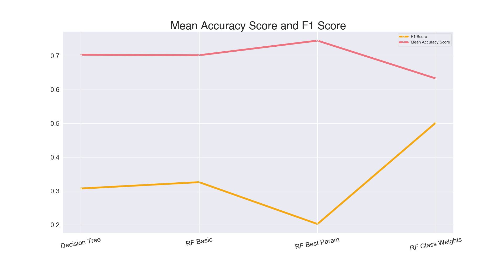

- Instacart partners with most supermarkets, and some local speciality shops depending on your area. Once you place an order a "personal shopper" will fulfill and deliver your order to your door on the same day
- This dataset is made up of 3 million food orders from about 120,000 customers from the company spanned across multiple CSV files

## Customer Information

# Sparse Data 
## Principal Components
- The original train and test data from the Kaggle Competition has an itemized list of each users most recent order
- To limit the number of features the data frame was organized by users and the number of purchases by aisle - PRODUCT NUM to 134 features. PCA was used to see if we can limit the number of features even further.
- Realizing that there needs to be 117 features (instead of our original 134) to account for 90% variance in the model tells us that the features are already orthogonal (or pretty close) and won't help us limit our features.
- Moving on!

# Supervised Machine Learning
## Can I predict what's in your cart?
- Can I predict if your order has the number one ordered item - Bananas!
- Even though it is the most purchased item with over 500,000 orders we are dealing with imbalanced classes, only about 25% of orders have bananas
- Lets look at the progession of scores over different models
    - Decision Tree
    - RF Basic = Random Forest with 50 trees
    - RF Best Param = Random Forest with 80 trees, max depth of 4, max features of 3, and min samples split of 4
    - RF Class Weights = Same as Best Param but used the weight of each class

- One trick for imbalanced classes is to add more data, so let's do it!
- Pulled in every order (not just the most recent order for each user) and performed a train-test-split with stratify on so my train and test have the same balance of 25% of orders with Bananas

## Unsupervised Machine Learning

#### Credits
*"The Instacart Online Grocery Shopping Dataset 2017” Accessed from [here](https://www.instacart.com/datasets/grocery-shopping-2017) on August 20th, 2020*
