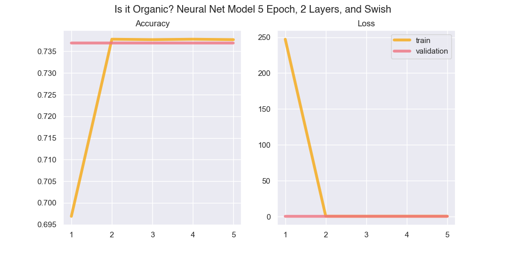
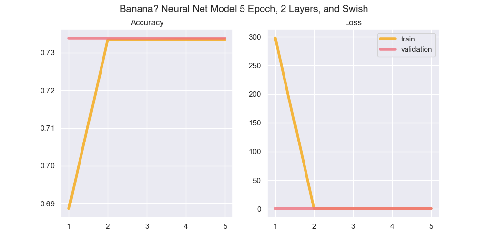

## The Data
- Instacart partners with most supermarkets, and some local specialty shops depending on your area. Once you place an order a "personal shopper" will fulfill and deliver your order to your door on the same day

- This dataset is made up of over 3 million food items orders from about 120,000 customers

## The Customer
###### Image below tells us customers are there for produce and value the "Organic" label

###### Date and time peaks tells us when we should ensure personal shoppers are available

###### What do customers with only 1 item order?
 

# High Dimensional Data

### Principal Components
- The original train and test data from the Kaggle Competition has an itemized list of each user's most recent order for a data frame of 200k+ orders and over 49k+ unique products. The goal is to predict if a customer will reorder an item.

- That data set creates a very sparse matrix, so it was reorganized to reflect the number of items ordered per aisle. PCA was used to see if we can limit the number of features even further. Realizing that there need to be 117 features (instead of our original 134) to account for 90% variance in the model tells us that the features are already orthogonal (or pretty close) and won't help us limit our features as much as I'd like to see.


- Next was to look at some feature engineering. Can we create addition features from the data we have to make a better prediction on wheater or not that particular user will reorder that specific item? The answer is always yes...

- I created a column to calculate the average percent of "new" items that each user orders


- I created a column to calculate the average items in a users cart


# Supervised Machine Learning
### Bananas
- Can I predict if your cart has the number one ordered item - Bananas!
    - **58%** of users have ordered Bananas at least once
    - Bananas and Organic Bananas have been ordered over **850,000** times in this data set

- Even with the information above we are dealing with imbalanced classes, so I'll need to account for that in our train test split and model parameters. For the various models, I will train we will look at each user, the time of day, day of the week, the number of items in cart, and days since prior order to predict if the user has a Banana in their cart.

- Let’s look at the progression of accuracy and our F1 score over different models


- The above image tells me I'm predicting fairly well on whether or not your cart has a Banana. The F1 score takes into account both false positives and false negatives, which will be a better indicator of how well my model is doing with this imbalanced class. I was surprised to see the Gradient Boost Model F1 score so low. 

# Supervised Machine Learning
### Organic
- Can I predict if your cart has an Organic item?
    - **10%** of products are Organic
    - **73%** of orders have at least 1 Organic item

- Yet again we're dealing with imbalanced classes so I'll need to account for that in the train test split and model parameters again. 

- The image above tells me that my models are predicting Organic items way more accurately than Bananas. With this train, test, split we are seeing F1 scores higher than our mean accuracy scores - which is good, in this case.

# Neural Nets


```
Organic Neural Net:
Epoch 1/5
loss: 247.2045 - accuracy: 0.6969 - val_loss: 0.5764 - val_accuracy: 0.7369

Epoch 2/5
loss: 0.6649 - accuracy: 0.7378 - val_loss: 0.5763 - val_accuracy: 0.7369

Epoch 3/5
loss: 0.6303 - accuracy: 0.7377 - val_loss: 0.5764 - val_accuracy: 0.7369

Epoch 4/5
loss: 0.6677 - accuracy: 0.7378 - val_loss: 0.5763 - val_accuracy: 0.7369

Epoch 5/5
loss: 0.6695 - accuracy: 0.7377 - val_loss: 0.5763 - val_accuracy: 0.7369
```

```
Banana Neural Net
Epoch 1/5
loss: 298.1448 - accuracy: 0.6887 - val_loss: 0.5794 - val_accuracy: 0.7339

Epoch 2/5
loss: 0.7434 - accuracy: 0.7334 - val_loss: 0.5793 - val_accuracy: 0.7339

Epoch 3/5
loss: 0.8325 - accuracy: 0.7334 - val_loss: 0.5794 - val_accuracy: 0.7339

Epoch 4/5
loss: 0.7049 - accuracy: 0.7335 - val_loss: 0.5793 - val_accuracy: 0.7339

Epoch 5/5
loss: 0.6982 - accuracy: 0.7335 - val_loss: 0.5793 - val_accuracy: 0.7339
```
- With both Neural Net results we are seeing a very high loss score and then a drastic drop after 1 Epoch. With such a large drop it looks like it flattens out at 0 when our reports actual land closer to 0.7

### The Final Model
- Given all the information provided by my models, the best model for predicting if a Banana is in someone’s order is Random Forest with Class Weights, which has the highest F1 score.
- The best model for predicting if an Organic item is in someone’s order is Random Forest with the Best Parameters from my GridSearch. Has the highest accuracy and highest F1 score.

### Next Steps
- Adjust the imbalance in both data sets by using oversampling, undersampling, and SMOTE to see the impact on my various models

- Work with the original high dimensional data set and answer the Kaggle challenge of being able to predict if a particular item will be reordered. I would approach this problem by melting the products into features and have each user be a row.

### Slide Deck
Click [here](https://docs.google.com/presentation/d/1BBCFvZQyoPhWqSCCnT39D1kuxSmetfv1qS_6LKE_Sn4/edit#slide=id.p) for slide deck.

### Credits
*"The Instacart Online Grocery Shopping Dataset 2017” Accessed from [here](https://www.instacart.com/datasets/grocery-shopping-2017) on August 20th, 2020*
