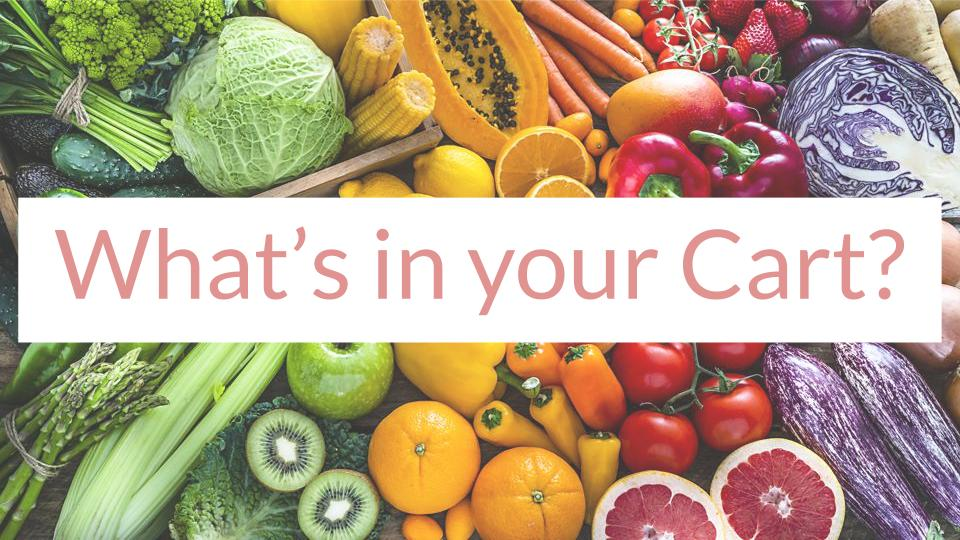
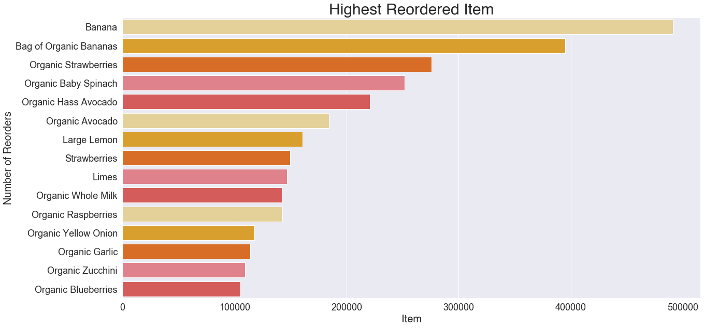
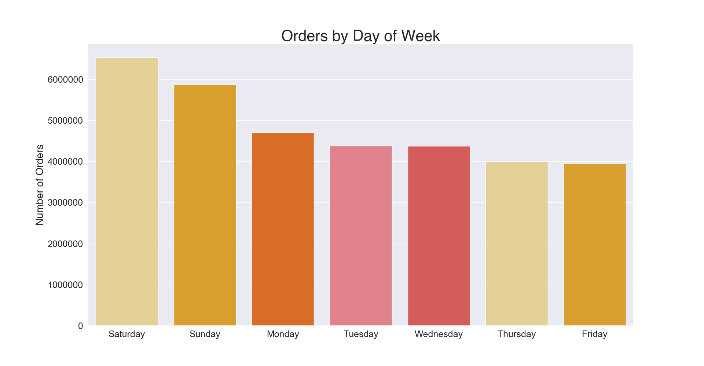
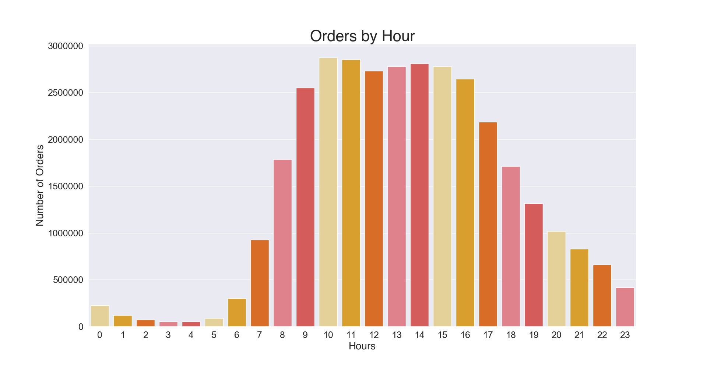
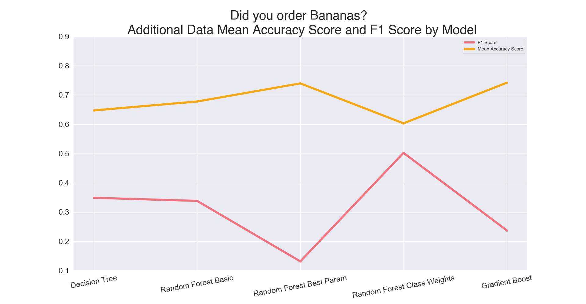
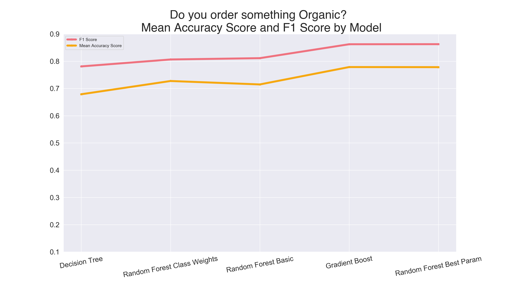

- Instacart partners with most supermarkets, and some local speciality shops depending on your area. Once you place an order a "personal shopper" will fulfill and deliver your order to your door on the same day
- This dataset is made up of 3 million food orders from about 120,000 customers from the company spanned across multiple CSV files

## Customer Information

# High Dimensional Data
 
### Principal Components
- The original train and test data from the Kaggle Competition has an itemized list of each users most recent order
- To limit the number of features the data frame was organized by users and the number of purchases by aisle accounting for 134 features. PCA was used to see if we can limit the number of features even further.
- Realizing that there needs to be 117 features (instead of our original 134) to account for 90% variance in the model tells us that the features are already orthogonal (or pretty close) and won't help us limit our features.
- Moving on!

# Supervised Machine Learning
### Bananas
- Can I predict if your cart has the number one ordered item - Bananas!
    - Fun fact: 58% of users have ordered Bananas at least once
    - Fun fact: Bananas have been ordered over 500,000 times 

- Even with the information above we are dealing with imbalanced classes, only about 25% of the orders have bananas

- Lets look at the progession of accuracy and F1 scores over different models

- The above image tells me I'm predicting fairly well on whether or not your cart has a Banana. The F1 score takes into account both false positives and false negatives, which may be a better indicator of how well my model is doing with this imbalanced class

- One trick for imbalanced classes is to add more data, so let's do it!

- Lets pull in every more orders and made sure both the training and test data have the same amount of Banana and non-Banana carts (like we did before)

- We'll also try out a Gradient Boost Model on this larger data set

- With more data we still have imbalanced classes, but these models perform fairly close to how they did with the smaller data set.

- Our Gradient Boost Model wasn't as helpful as I thought it maybe. 

# Supervised Machine Learning
### Organic
- Can I predict if your cart has an Organic item?
    - Fun fact: ADD% of users have ordered something organic at least once
    - Fun fact: Organic items account for ADD% of the product list
- Yet again we're dealing with imbalanced classes. At least one Organic items appear in 75% of each order.

### Next Steps
- Adjust the imbalance in both data sets by using oversampling, undersampling, and SMOTE to see the impact on my various models

- Work with the original high deminsonal data set and answer the Kaggle challenge of being able to predict if a particular item will be reordered

### Credits
*"The Instacart Online Grocery Shopping Dataset 2017” Accessed from [here](https://www.instacart.com/datasets/grocery-shopping-2017) on August 20th, 2020*
